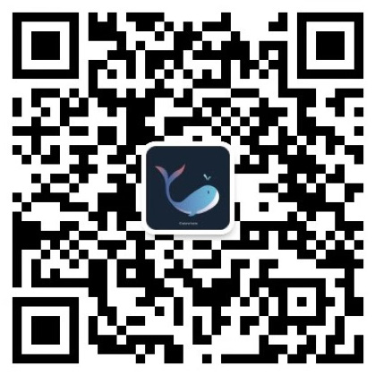

# 啃瓜食材清单
1. 🍉西瓜书：周志华老师的《机器学习》
2. 🎃南瓜书：各大电商平台搜“《机器学习公式详解》第2版”
3. [将西瓜书和南瓜书串起来讲解的视频教程：](https://www.bilibili.com/video/BV1Mh411e7VU)

## 任务列表

- Task01：概览西瓜书南瓜书第1、2章
- Task02：详读西瓜书+南瓜书第3章——线性回归
- Task03：详读西瓜书+南瓜书第3章——对数几率回归
- Task04：详读西瓜书+南瓜书第3章——线性判别分析
- Task05：详读西瓜书+南瓜书第4章
- Task06：详读西瓜书+南瓜书第5章
- Task07：详读西瓜书+南瓜书第6章

- 扫码关注公众号：Datawhale

